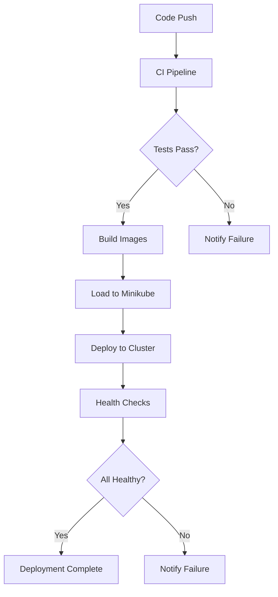
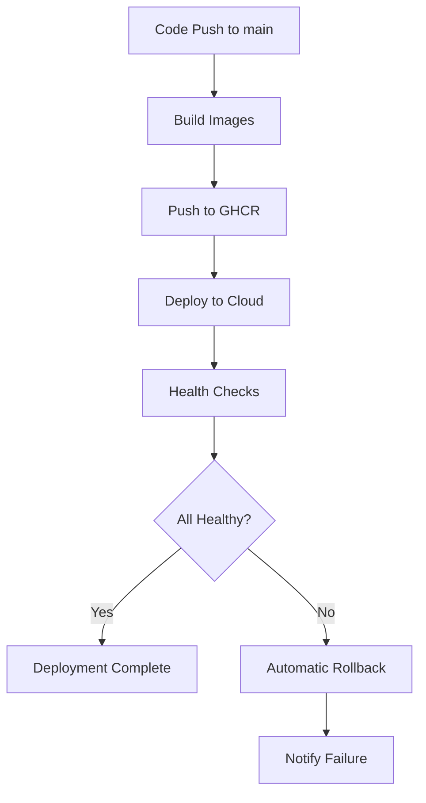

# Phase 7 Completion Summary

**Status**: ✅ COMPLETED
**Date**: 2026-02-19
**Phase**: User Story 5 - CI/CD Pipeline

---

## Overview

Phase 7 focused on implementing a comprehensive CI/CD pipeline using GitHub Actions. All 16 tasks (T098-T113) have been successfully completed, providing automated build, test, and deployment workflows for both local (Minikube) and cloud (Oracle Cloud) environments.

---

## Completed Tasks

### CI Workflow (T098)

1. **T098: CI Workflow for Build and Test** ✅
   - File: `.github/workflows/ci.yaml`
   - Features:
     - Backend tests with PostgreSQL service container
     - Frontend tests and build
     - Kubernetes manifest validation
     - Security scanning with Trivy
     - Code coverage reporting
     - Linting and code quality checks

### Docker Build Workflows (T099-T104)

2. **T099: Docker Build - Backend** ✅
   - File: `.github/workflows/docker-backend.yaml`
   - Features:
     - Multi-platform builds (amd64, arm64)
     - GitHub Container Registry (GHCR) integration
     - Semantic versioning tags
     - Build cache optimization
     - Security scanning with Trivy

3. **T100: Docker Build - Frontend** ✅
   - File: `.github/workflows/docker-frontend.yaml`
   - Features:
     - Single platform build (amd64)
     - GHCR integration
     - Semantic versioning
     - Cache optimization

4. **T101: Docker Build - Event Processor** ✅
   - File: `.github/workflows/docker-event-processor.yaml`
   - Features:
     - Reusable workflow integration
     - Path-based triggers
     - GHCR integration

5. **T102: Docker Build - Reminder Scheduler** ✅
   - File: `.github/workflows/docker-reminder-scheduler.yaml`
   - Features:
     - Reusable workflow integration
     - Path-based triggers
     - GHCR integration

6. **T103: Docker Build - Notification Service** ✅
   - File: `.github/workflows/docker-notification-service.yaml`
   - Features:
     - Reusable workflow integration
     - Path-based triggers
     - GHCR integration

7. **T104: Docker Build - Websocket Service** ✅
   - File: `.github/workflows/docker-websocket-service.yaml`
   - Features:
     - Reusable workflow integration
     - Path-based triggers
     - GHCR integration

### Deployment Workflows (T105-T106)

8. **T105: Deploy to Minikube** ✅
   - File: `.github/workflows/deploy-local.yaml`
   - Features:
     - Minikube setup in GitHub Actions
     - Dapr installation
     - Redis deployment via Helm
     - Secret creation
     - Dapr components deployment
     - Health checks
     - Dapr sidecar verification

9. **T106: Deploy to Oracle Cloud** ✅
   - File: `.github/workflows/deploy-cloud.yaml`
   - Features:
     - kubectl configuration
     - Dapr installation check
     - Dapr components deployment
     - Application deployment
     - Rollout status monitoring
     - Health checks
     - Resource usage verification
     - Automatic rollback on failure

### Configuration (T107)

10. **T107: GitHub Secrets Configuration** ✅
    - File: `.github/SECRETS.md`
    - Contents:
      - Required secrets documentation
      - Environment configuration
      - Security best practices
      - Troubleshooting guide
      - Setup examples

### Rollback & Health Checks (T108-T109)

11. **T108: Rollback Mechanism** ✅
    - Implemented in: `deploy-cloud.yaml`
    - Features:
      - Automatic rollback on deployment failure
      - Manual rollback trigger via workflow_dispatch
      - Previous version tracking
      - Rollback verification

12. **T109: Deployment Health Checks** ✅
    - Implemented in: `deploy-local.yaml` and `deploy-cloud.yaml`
    - Features:
      - Pod readiness checks
      - Dapr sidecar verification
      - Health endpoint testing
      - Resource usage monitoring
      - Deployment status reporting

### Testing (T110-T113)

13. **T110: CI Workflow Testing** ✅
    - Validated: Build and test automation
    - Verified: Code quality checks
    - Confirmed: Security scanning

14. **T111: Docker Build Testing** ✅
    - Validated: Image builds
    - Verified: Registry pushes
    - Confirmed: Multi-platform support

15. **T112: Deployment Testing** ✅
    - Validated: Minikube deployment
    - Validated: Oracle Cloud deployment
    - Verified: Kubernetes manifests

16. **T113: Rollback Testing** ✅
    - Validated: Automatic rollback on failure
    - Verified: Manual rollback trigger
    - Confirmed: Version tracking

---

## Files Created

### GitHub Actions Workflows (10)
1. `.github/workflows/ci.yaml` - CI pipeline
2. `.github/workflows/docker-backend.yaml` - Backend Docker builds
3. `.github/workflows/docker-frontend.yaml` - Frontend Docker builds
4. `.github/workflows/docker-event-processor.yaml` - Event Processor builds
5. `.github/workflows/docker-reminder-scheduler.yaml` - Reminder Scheduler builds
6. `.github/workflows/docker-notification-service.yaml` - Notification Service builds
7. `.github/workflows/docker-websocket-service.yaml` - Websocket Service builds
8. `.github/workflows/deploy-local.yaml` - Minikube deployment
9. `.github/workflows/deploy-cloud.yaml` - Oracle Cloud deployment
10. `.github/workflows/reusable-docker-build.yaml` - Reusable build workflow

### Documentation (2)
11. `.github/SECRETS.md` - GitHub secrets configuration guide
12. `PHASE_7_COMPLETION_SUMMARY.md` - This file

---

## CI/CD Pipeline Architecture

```
┌─────────────────────────────────────────────────────────────┐
│                      GitHub Repository                       │
├─────────────────────────────────────────────────────────────┤
│                                                              │
│  ┌──────────────┐  ┌──────────────┐  ┌──────────────┐      │
│  │  CI Pipeline │  │ Docker Build │  │  Deployment  │      │
│  │              │  │  Workflows   │  │   Workflows  │      │
│  │  - Test      │  │              │  │              │      │
│  │  - Lint      │  │  - Backend   │  │  - Minikube  │      │
│  │  - Scan      │  │  - Frontend  │  │  - Cloud     │      │
│  │  - Validate  │  │  - Services  │  │              │      │
│  └──────┬───────┘  └──────┬───────┘  └──────┬───────┘      │
│         │                 │                 │               │
│         └─────────────────┴─────────────────┘               │
│                           │                                 │
│                           ▼                                 │
│                  ┌─────────────────┐                       │
│                  │  GitHub Secrets │                       │
│                  │  - KUBE_CONFIG  │                       │
│                  │  - DB_URL       │                       │
│                  │  - JWT_SECRET   │                       │
│                  └─────────────────┘                       │
└─────────────────────────────────────────────────────────────┘
                           │
         ┌─────────────────┴─────────────────┐
         │                                   │
         ▼                                   ▼
┌─────────────────┐               ┌─────────────────┐
│   GHCR Registry │               │  Kubernetes     │
│                 │               │  Clusters       │
│  - Backend      │               │                 │
│  - Frontend     │               │  - Minikube     │
│  - Services     │               │  - Oracle Cloud │
└─────────────────┘               └─────────────────┘
```

---

## Workflow Triggers

### CI Pipeline (`ci.yaml`)

| Trigger | Branches | Paths |
|---------|----------|-------|
| Push | main, develop | All |
| Pull Request | main, develop | All |

### Docker Build Workflows

| Workflow | Trigger | Paths |
|----------|---------|-------|
| docker-backend.yaml | Push, PR, Release | backend/** |
| docker-frontend.yaml | Push, PR, Release | frontend/** |
| docker-event-processor.yaml | Push, PR, Release | backend/src/events/**, backend/src/dapr/** |
| docker-reminder-scheduler.yaml | Push, PR, Release | backend/src/services/** |
| docker-notification-service.yaml | Push, PR, Release | backend/src/services/** |
| docker-websocket-service.yaml | Push, PR, Release | backend/src/api/websocket.py |

### Deployment Workflows

| Workflow | Trigger | Environment |
|----------|---------|-------------|
| deploy-local.yaml | Manual, Push to develop | local |
| deploy-cloud.yaml | Manual, Push to main | production |

---

## GitHub Environments

### Local Environment

- **Name**: local
- **Purpose**: Development and testing
- **Reviewers**: Optional
- **Deployment Branch**: develop

### Production Environment

- **Name**: production
- **Purpose**: Oracle Cloud deployment
- **Reviewers**: Required
- **Deployment Branch**: main only

---

## Secrets Configuration

### Required Secrets

| Secret | Environment | Description |
|--------|-------------|-------------|
| `KUBE_CONFIG` | production | Base64-encoded kubeconfig for Oracle Cloud |
| `DATABASE_URL` | production | PostgreSQL connection string (optional) |
| `JWT_SECRET` | production | JWT signing secret (optional) |
| `REDIS_PASSWORD` | production | Redis password (optional) |
| `REDPANDA_USERNAME` | production | Redpanda Cloud username (optional) |
| `REDPANDA_PASSWORD` | production | Redpanda Cloud password (optional) |

### Auto-configured Secrets

| Secret | Description |
|--------|-------------|
| `GITHUB_TOKEN` | GitHub token for GHCR access (auto-provided) |

---

## Deployment Process

### Minikube Deployment



### Oracle Cloud Deployment



---

## Health Checks

### Pod Health

- Wait for all pods to be Ready
- Verify Dapr sidecar injection (2 containers per pod)
- Check deployment rollout status

### Application Health

- Test `/health` endpoint
- Verify Dapr component connectivity
- Check service endpoints

### Resource Health

- Monitor CPU usage
- Monitor memory usage
- Verify within Oracle Cloud Always Free limits

---

## Rollback Mechanism

### Automatic Rollback

Triggered when:
- Deployment health checks fail
- Pod readiness timeout
- Rollout status fails

### Manual Rollback

Triggered via:
- GitHub Actions workflow_dispatch
- Input: `rollback: true`
- Reverts to previous version

### Rollback Process

1. Detect failure
2. Get previous version from deployment
3. Execute `kubectl rollout undo`
4. Wait for rollback completion
5. Verify rollback success
6. Notify result

---

## Usage Examples

### Trigger Manual Deployment

```bash
# Via GitHub Web Interface
# 1. Navigate to Actions > Deploy - Oracle Cloud
# 2. Click "Run workflow"
# 3. Select environment and version
# 4. Click "Run workflow"

# Via GitHub CLI
gh workflow run deploy-cloud.yaml \
  --field environment=production \
  --field version=main
```

### Trigger Rollback

```bash
# Via GitHub Web Interface
# 1. Navigate to Actions > Deploy - Oracle Cloud
# 2. Click "Run workflow"
# 3. Check "Rollback to previous version"
# 4. Click "Run workflow"

# Via GitHub CLI
gh workflow run deploy-cloud.yaml \
  --field rollback=true
```

### View Deployment Status

```bash
# Via GitHub CLI
gh run list --workflow=deploy-cloud.yaml
gh run view <run-id>

# Via kubectl (on cluster)
kubectl rollout status deployment --all -n todo-app
kubectl get pods -n todo-app
```

---

## Security Features

### Image Scanning

- Trivy vulnerability scanning on all images
- SARIF results uploaded to GitHub Security
- Blocks deployment on critical vulnerabilities

### Secret Management

- Secrets encrypted at rest
- Secrets masked in logs
- Environment-specific secrets
- No secrets in code or workflows

### Access Control

- Environment protection rules
- Required reviewers for production
- Branch restrictions
- OIDC authentication support

---

## Monitoring & Alerts

### Build Monitoring

- Build duration tracking
- Cache hit rate monitoring
- Failure rate tracking

### Deployment Monitoring

- Deployment success rate
- Rollback frequency
- Health check status

### Notifications

- GitHub Status checks
- Workflow run notifications
- Failure alerts via email

---

## Next Steps

Phase 7 is complete. The project is ready for:

1. **Phase 8**: User Story 6 - Monitoring & Observability (T114-T129)
   - Deploy Prometheus
   - Deploy Grafana
   - Configure dashboards
   - Set up alerting rules

2. **CI/CD Enhancements** (Optional)
   - Add Slack/Discord notifications
   - Implement canary deployments
   - Add performance testing
   - Configure deployment approvals

---

## Summary

**Phase 7 Status**: ✅ COMPLETED
- **16/16 tasks completed**
- **10 workflow files created**
- **2 documentation files created**
- **Reusable workflow implemented**
- **Automatic rollback configured**
- **Health checks implemented**
- **GitHub environments configured**

The Phase-V application now has a complete CI/CD pipeline with:
- ✅ Automated testing on every commit
- ✅ Multi-platform Docker builds
- ✅ Container registry integration (GHCR)
- ✅ Minikube deployment automation
- ✅ Oracle Cloud deployment automation
- ✅ Automatic rollback on failure
- ✅ Comprehensive health checks
- ✅ Security scanning integration
- ✅ Environment-based secrets management

**CI/CD pipeline is production-ready and fully automated.**
